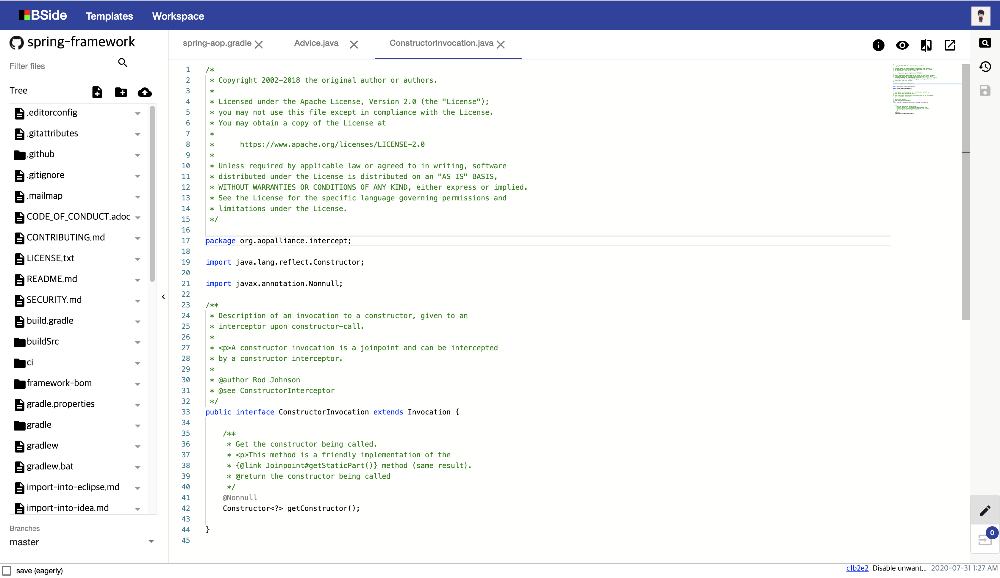

[](https://travis-ci.com/qwefgh90/bside)

# BSide - A tool to help editing in everywhere
BSide is Github CMS to make your editing more easier and faster in any device.
The devleoper can manage contents of the repository directly on the modern browser without cloning the project and making commits.
It also provides embedded tools and views to help the software developer to manage the blog hosted on Github Page.



## Key features

BSide try to provide new features which other services doesn't provide.

### Lightweight Web IDE

As if you use the desktop IDE, You can directly create, rename, edit, remove contents after selecting the left tree explorer or the tab. 

- Tree explorer
- Tab
- Editor
- File upload
- Drag and Drop
- Keeping works on browser storage
- Information view for building the page
- Markdown preview
- Diff view for changes
- Stage view before commit

### Mobile support

Software developers can use it when they think of the idea or want to manage the blog. 
It supports Chrome, Firefox, Safari, Edge beta.

## Development

[NodeJS 10+](https://nodejs.org/ko/download/), [JDK 11+](https://jdk.java.net/archive/) and Maven 3+ are requried.

### Angular (/web)

A Web application is based on Angular 8+. So you should consider Angular CLI as the first tool when creating some files.

#### Running in localhost

There are predefined scripts to make it easy to develop this project.

```
npm install
npm run start
```

#### Testing

All unit tests should be passed. There is no other test than unit test until now.

```
npm run test
```

### Server API (/api)

#### Creating A OAuth App for local authenticating

It is important to get your own **Client ID** and **Client Secret** by creating new oauth application in [Github](https://github.com/settings/developers).
And then ensure that spring boot find Client ID and Client Secret by adding them to `application-oauth.properties` or make them environment variables. Otherwise, ouath authenticating will fail. **`application-oauth.properties` is being ignored** so it is not contained in a next commit.

``` properties
github.client_id=your_temporary_client_id
github.client_secret=your_temporary_client_secret
```

#### Running in localhost

You can run a main class on IntelliJ.

#### Testing

All unit tests should be passed. There is no other test than unit test until now.

```
mvn test
```

## Contributing

Pull requests are welcome. For major changes, please open an issue first to discuss what you would like to change.

Please make sure to update tests as appropriate.